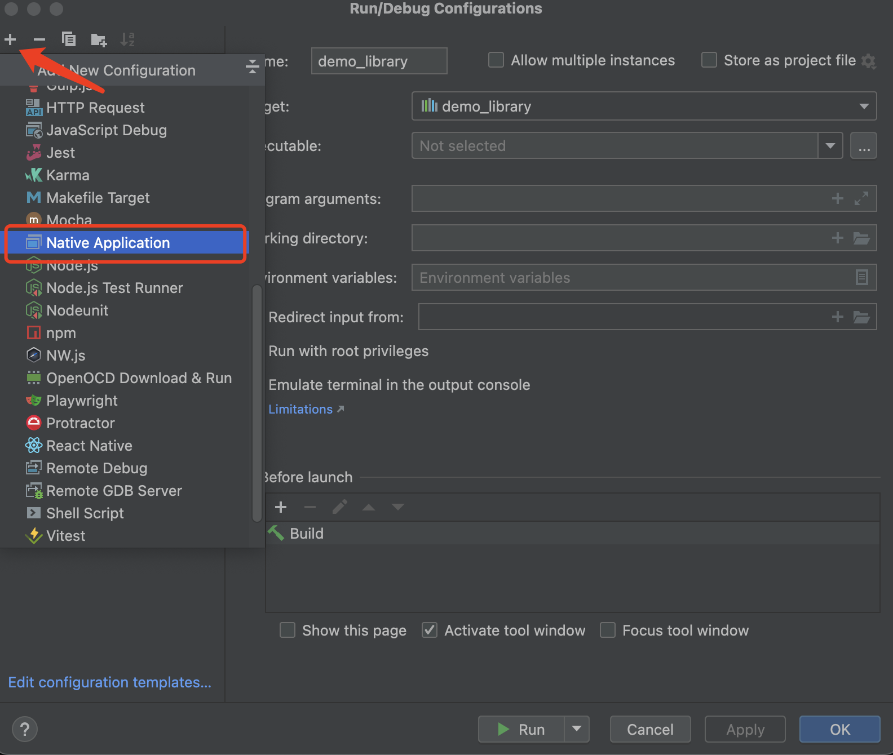
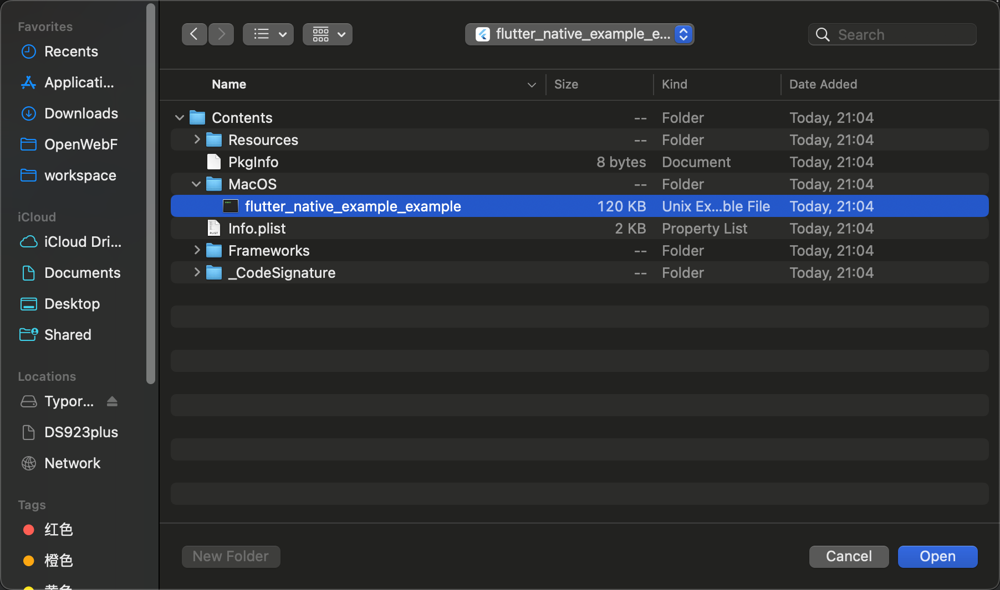
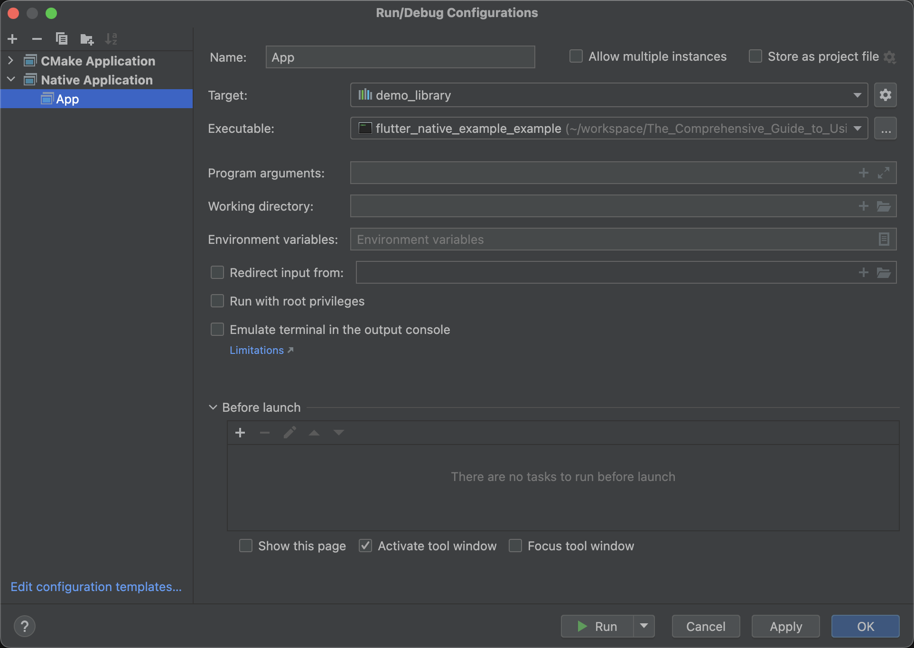

# Setting up Develop and Debugging Environment for your C/C++ project —- Guide Part II

For an flutter app developments, it's easy to set up an development and debugger environment with Dart using Code or Jetbrains IDE. 

But using C/C++ in Flutter, things will be more different, because the offical Dart & Flutter IDE plugins was not designed for C/C++ developments.

For developing and debugging C/C++ in multiple variaty of operation systems, we needs to config and step up different IDE for each of platforms as follows:

## SetUp environment for C/C++ developments

They are many develop environments for C/C++ projects. We can use Xcode for iOS and macOS, Android Studio for Android, Visual Studio for Windows and other IDE tools for Linux platforms.

In my personal working experience, the best development IDE that I had used for most of the time is JetBrains's Clion, which providing the universal development experiences for each platforms. 

For developers who using C/C++ in Flutter apps, it's normal to deploy and sharing the same code base for all platform with different operating system and CPU archs. For using the same IDE, it's more convenient for reusing your experiences for using these tools.

### Config your C/C++ project with Clion

Clion has built-in support for CMake projects, to setup Clion with intellisense, you needs to open the project fold which contains the `CMakeLists.txt` file, it our example project, that will be `<project_root>/src`:


The clion will config your C/C++ projects based on your CMake config automatically. 

### Debugging your Flutter Apps with Clion

It's easier to debugging and Flutter apps with Clion on desktop platforms, including macOS, Windows and Linux.

It's also recommend to developing your C/C++ codes on desktop first, then cross-compile them and running on mobile platforms.

**Start an Flutter apps with Clion LLDB Debugger**

At first, you needs to compile your flutter apps:

```bash
flutter build macos --debug
```

After your flutter apps compiled, the app will generated at `<project_root>/example/build/macos/Build/Products/Debug/flutter_native_example_example.app`.

> For Linux or Windows platform, just looking for your flutter apps located under `<project_root>/example/build/` directory.

**Add an Debugger configuration in Clion**

Open your Clion, click the `Editr Configurations` selection menu on the top:


Click the `+` button on top left, and select the `Native Application`:



Remove the default `Build` configure on the middle bottom, and then click dropdown menu with `Executable:` tag:


Find and select the executable file for your Flutter apps in `<project_root>/example/build/` directory.



The selection results will be as follows:

