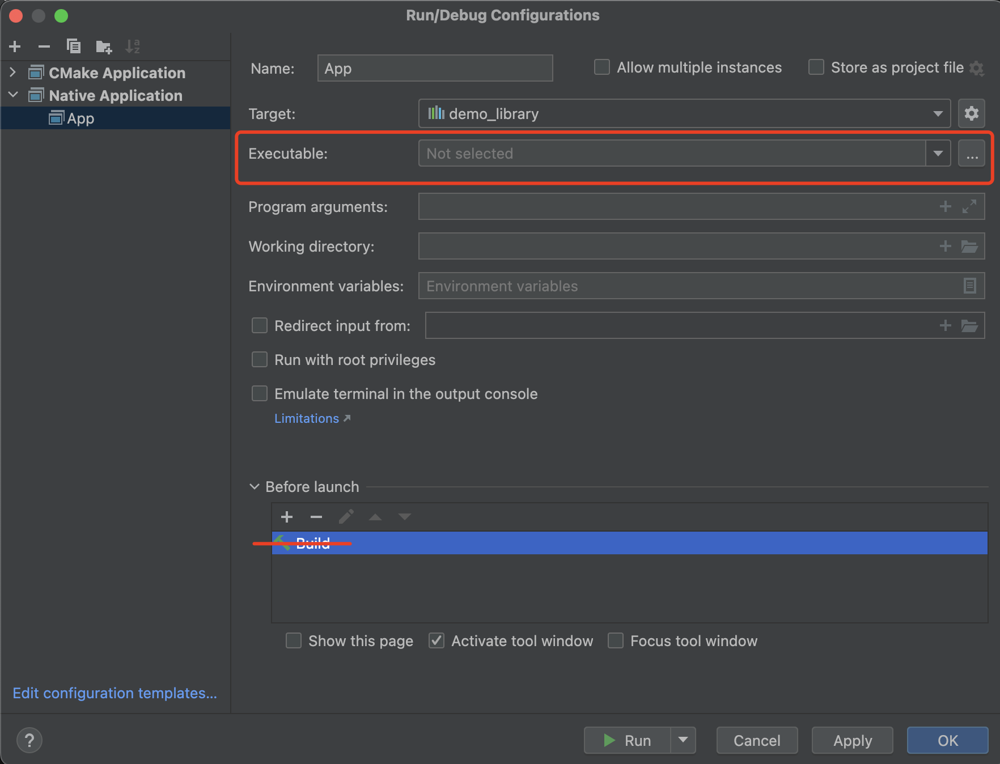
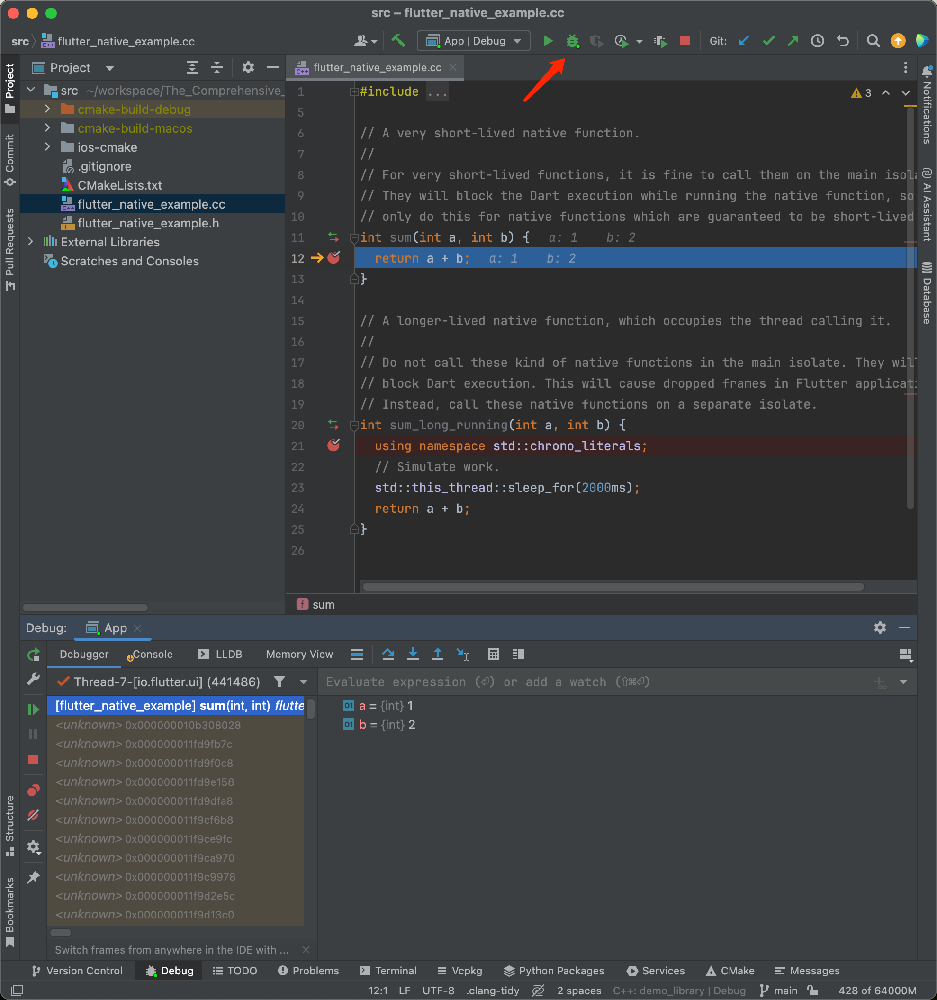
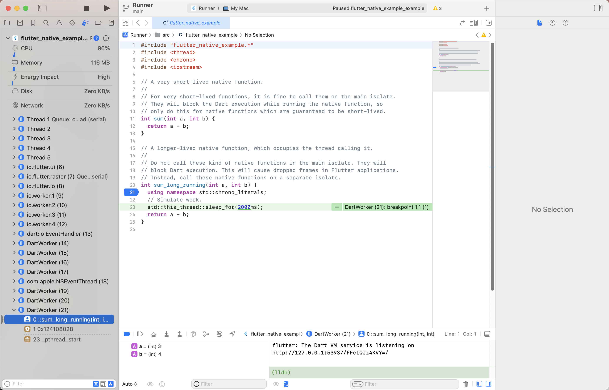
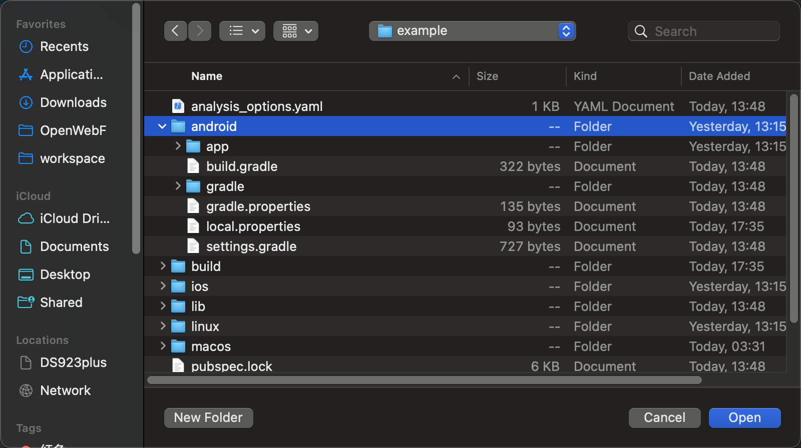
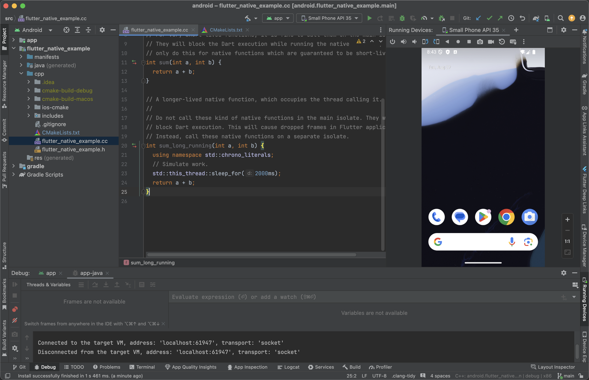
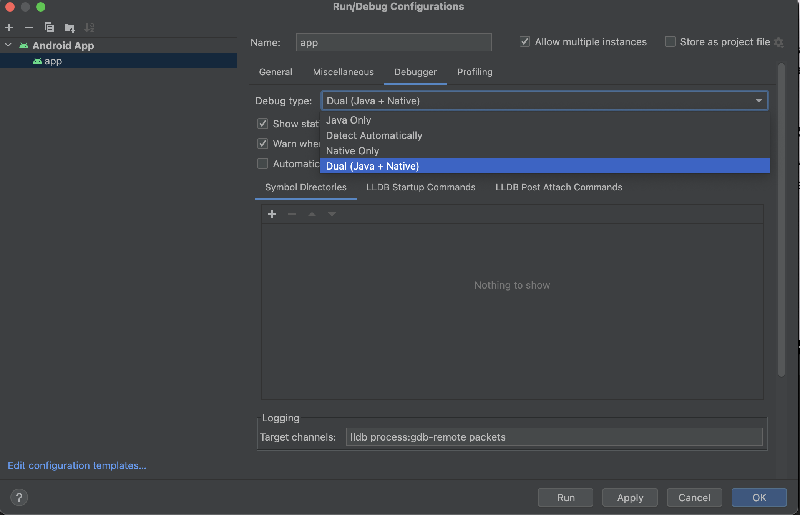
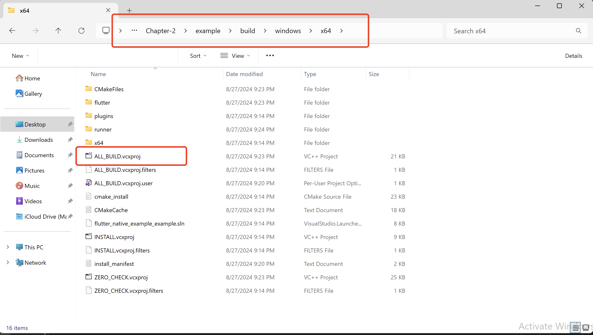
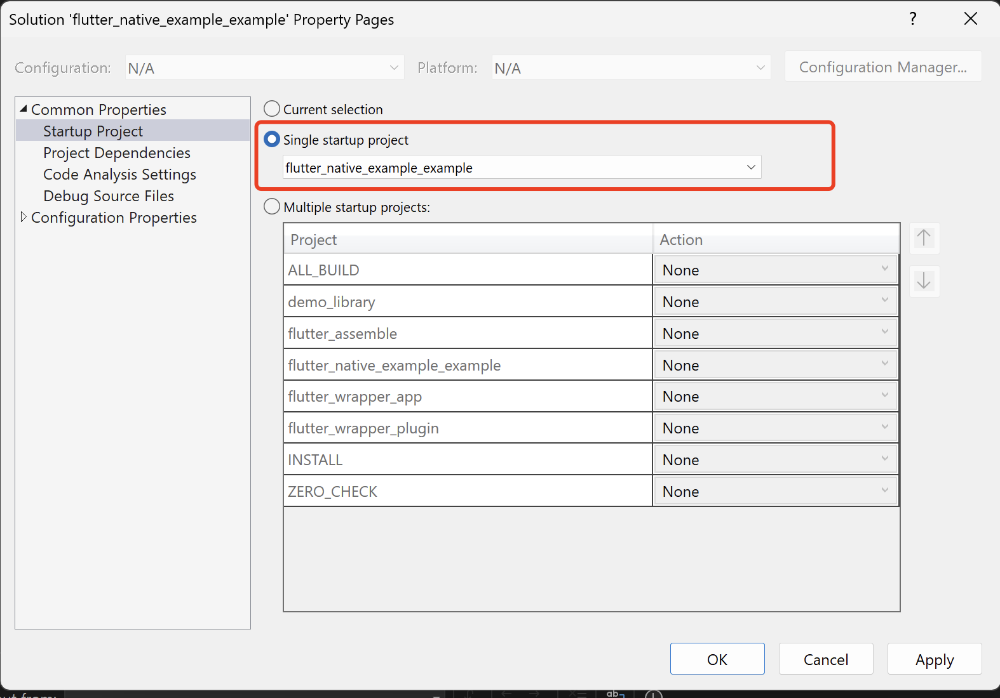
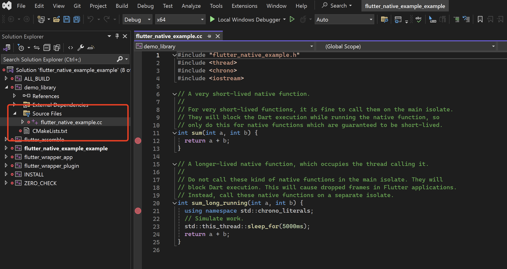
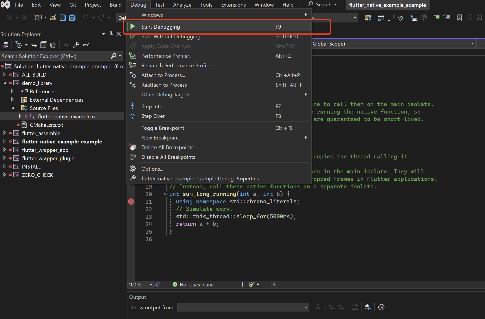

# Setting Up a Development and Debugging Environment for Your C/C++ Project with Flutter Apps — Guide Part II

For Flutter app development, it's easy to set up a development and debugging environment with Dart using VS Code or JetBrains IDE. 

However, when using C/C++ in Flutter, things are different because the official Dart & Flutter IDE plugins are not designed for C/C++ development.

To develop and debug C/C++ on multiple operating systems, we need to configure and set up different IDEs for each platform as follows:

There are many development environments for C/C++ projects. We can use Xcode for iOS and macOS, Android Studio for Android, Visual Studio for Windows, and other IDE tools for Linux platforms.

In my personal experience, the best development IDE I have used most often is JetBrains' CLion, which provides a consistent development experience across platforms.

For developers using C/C++ in Flutter apps, it's common to deploy and share the same codebase across different platforms with various operating systems and CPU architectures. Using the same IDE makes it more convenient to reuse your experience with these tools.

## Configuring Your C/C++ Project with CLion

CLion has built-in support for CMake projects. To set up CLion with IntelliSense, you need to open the project folder that contains the `CMakeLists.txt` file. In our example project, that will be `<project_root>/src`:


CLion will configure your C/C++ projects based on your CMake configuration automatically.

### Debugging Your Flutter Apps with CLion

It's easier to debug Flutter apps with CLion on desktop platforms, including macOS, Windows, and Linux.

It's also recommended to develop your C/C++ code on a desktop first, then cross-compile it and run it on mobile platforms.

**Starting a Flutter App with CLion LLDB Debugger**

First, you need to compile your Flutter app:

```bash
flutter build macos --debug
```

After your Flutter app is compiled, the app will be generated at `<project_root>/example/build/macos/Build/Products/Debug/flutter_native_example_example.app`.

> For Linux or Windows platforms, just look for your Flutter app under the `<project_root>/example/build/` directory.

**Adding a Debugger Configuration in CLion**

Open CLion, click the `Edit Configurations` selection menu at the top:


Click the `+` button on the top left and select `Native Application`:


Remove the default `Build` configuration at the middle bottom, and then click the dropdown menu with the `Executable:` tag:



Find and select the executable file for your Flutter app in the `<project_root>/example/build/` directory.


The selection results will be as follows:


Now it's ready for debugging. Click the debug icon on the top bar to start your debugging:



**Attaching a Running Application with CLion Debugger**

If your application started earlier than the CLion debugger, you can attach an existing running Flutter app with the `Attach To Process` feature in CLion:


## Debugging C/C++ Code in Xcode

Xcode is an alternative IDE for C/C++ debugging on macOS and iOS platforms. First, open the `Runner.xcworkspace` project in Xcode.

The source code of our C/C++ code is not visible in Xcode by default, so we need additional setup to make it visible and allow setting breakpoints on it:

In Xcode, right-click the `Runner` project and select `Add Files to "Runner"`:


Select the source folder that contains `CMakeLists.txt`, but keep in mind to unselect all targets at the bottom because we don't want Xcode to package our C/C++ code in our project.


Now we can set breakpoints in Xcode and debug the C++ source code:



## Debugging C/C++ Code in Android Studio

Android Studio for Android has built-in support for developing and debugging C/C++ code.

For a Flutter app for Android, open the `example/android` directory in Android Studio:



Once your project is fully configured in Android Studio, you will see your C/C++ code recognized and indexed by Android Studio.



Click the `app` entry point at the top and select "Edit Configuration":


Make sure the debug type is set to "Dual (Java + Native)" mode:



Now our C/C++ code can be developed and debugged in Android Studio:


## Debugging C/C++ Code in Visual Studio

Visual Studio on the Windows platform provides a robust developer experience for C/C++.

Flutter projects use CMake to generate Visual Studio project templates.

First, compile your Flutter app by running the following command:

```bash
flutter build windows --debug
```

This will generate the Visual Studio project workspace in the `<project_root>/example/build/windows/x64` directory. Open Visual Studio and load the `ALL_BUILD.vcproj` file from this location.



Right-click on the solution title and select `Properties`:


Change the `Single startup project` value to `flutter_native_example_example`:



Open the C/C++ code files in the `demo_library` folder and set your breakpoints:



Click on `Debug` -> `Start Debugging`:



Now the debugger should be working:


## Next Chapter

In the next chapter, we will focus on Dart FFI in Flutter apps, covering bidirectional synchronous and asynchronous calls, handling complex data structures, and performance optimization tips.